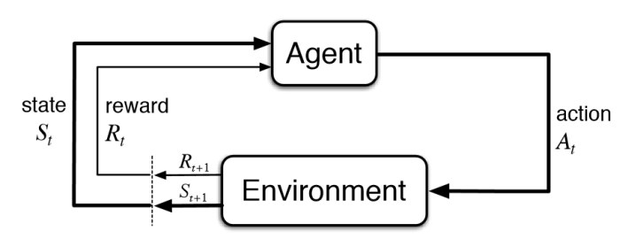

# Introduction 
## Intro & Outline 
* RL is way different that SL & UL 
* Typical SL
    ~~~
    class SupModel:
        def fit(X,Y):
            ....
        def prefict(X):
            ...
    ~~~
* Typical UL
    ~~~
    class UnsupModel:
        def fit(X):
            ...
        def transform(X) # PCA, AE, RBS
            ...          # K-means, GMM don't really transform data
    ~~~
* Commonalities with Ul and SL 
    1. interface with training data (metrics and numbers)
    2. make prediction 
* Differences 
    1. guide an agent to act in real world 
    2. interface to much broad training set 
    3. model behaviour (psychology), objective to meet goal rather minimising data-set 
    4. no need for hand labeled data than self learn from inputs 
    5. _desire to be more rich is due to the dominant nature of corresponding gene_
    6. concept of states, a toc-tac-toe has $3^9$ possible state 
    7. Agents try to maximise its reward 
    8. reward must be made intelligently 
    
### terms
1. agent
2. environment 
3. action 
4. reward 

### timing 

# Multi-armed Bandit problem 

* there are 3 slot machine in a casino, each gives reward/penalty 
* win rate is unknown, hence collect data by trying to feature out the winning rate 
* determine the machine with highest win-rate 
* to maximise the earning, you've to spend a lot of money

### Traditional A/B Testing (Explore-Exploit Dilemma)
* predetermine how much time you'll be playing on each bandit to get the stat 
* number of times depends on differences of win-rate between systems 
* you can't stop early ! 

### Eplison-Greedy strategy 
* Use a small number $\epsilon$ : probability of exploration (5-10%)
    ~~~
        p =random()
        if p < eps:
            pull random arm
        else
            pull current-best arm
    ~~~
* eventually the best arm will be found
* in long run, it'll explore all the arms infinite amount of time 
* __Problem__ : let you explore when exploration is not needed anymore 

### Estimating bandit rewards 
* Assuming bandit reward is not just coin-tosses, what's the best way to keep track of them ? 
* general method is mean 
* __Problem__ : store all n elements to track the mean 
* __Efficient mean__ : (1-1/N)Mu_{N-1} + 1/N*X_n

### Optimistic Initial Value (OIV) method
* start with a initial value
* no eps, just greedy 

### UCB1
* uses confidence bounds 
* samples of 10 is less accurate than samples of 100
* Chernoff-Hoeffding bound : confidence bound changes exponentially with sample size 
    * P{|mean(X) - Mu| >= eps} <= 2exp{-2*(eps ^2)*N}
    * Algorithm : X_{UCB-j} = \barX_j + \sqrt(c)
